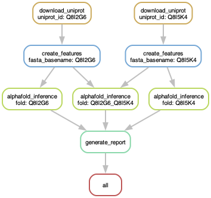

README.md A snakemake pipeline for automated structure prediction using various backends.

## Installation

Before installation, make sure your python version is at least 3.10.

```bash
python3 --version
```

1. **Install Dependencies**

    ```bash
    pip install snakemake==7.32.4 snakedeploy==0.10.0 pulp==2.7 click==8.1 cookiecutter==2.6
    ```

2. **Snakemake Cluster Setup**

    In order to allow snakemake to interface with a compute cluster, we are going to use the [Snakemake-Profile for SLURM](https://github.com/Snakemake-Profiles/slurm). If you are not working on a SLURM cluster you can find profiles for different architectures [here](https://github.com/Snakemake-Profiles/slurm). The following will create a profile that can be used with snakemake and prompt you for some additional information.

    ```bash
    git clone https://github.com/Snakemake-Profiles/slurm.git
    profile_dir="${HOME}/.config/snakemake"
    mkdir -p "$profile_dir"
    template="gh:Snakemake-Profiles/slurm"
    cookiecutter --output-dir "$profile_dir" "$template"
    ```

    During the setup process, you will be prompted to answer several configuration questions. Below are the questions and the recommended responses:

    - `profile_name [slurm]:` **slurm_noSidecar**
    - `Select use_singularity:` **1 (False)**
    - `Select use_conda:` **1 (False)**
    - `jobs [500]:` *(Press Enter to accept default)*
    - `restart_times [0]:` *(Press Enter to accept default)*
    - `max_status_checks_per_second [10]:` *(Press Enter to accept default)*
    - `max_jobs_per_second [10]:` *(Press Enter to accept default)*
    - `latency_wait [5]:` **30**
    - `Select print_shell_commands:` **1 (False)**
    - `sbatch_defaults []:` **qos=low nodes=1**
    - `Select cluster_sidecar:` **2 (no)**
    - `cluster_name []:` *(Press Enter to leave blank)*
    - `cluster_jobname [%r_%w]:` *(Press Enter to accept default)*
    - `cluster_logpath [logs/slurm/%r/%j]:` *(Press Enter to accept default)*
    - `cluster_config []:` *(Press Enter to leave blank)*

    After responding to these prompts, your Slurm profile named *slurm_noSidecar* for Snakemake will be configured as specified.

3. **Singularity (Probably Installed Already)**: This pipeline makes use of containers for reproducibility. If you are working on the EMBL cluster singularity is already installed and you can skip this step. Otherwise, please install Singularity using the [official Singularity guide](https://sylabs.io/guides/latest/user-guide/quick_start.html#quick-installation-steps).


4. **Download The Pipeline**:
    This will download the version specified by '--tag' of the snakemake pipeline and create the repository AlphaPulldownSnakemake, or any other name you choose.
    ```bash
    snakedeploy deploy-workflow \
      https://github.com/KosinskiLab/AlphaPulldownSnakemake \
      AlphaPulldownSnakemake \
      --tag 2.2.0
    cd AlphaPulldownSnakemake
    ```

## Configuration

Adjust `config/config.yaml` for your particular use case:
```yaml
# List of input sample sheets
input_files:
  - config/sample_sheet.csv

# Delimiter used in protein names
protein_delimiter: "_"

# Directory where all output files will be stored
output_directory: /path/to/output/directory

# Path to AlphaFold database containing required weights and files
alphafold_data_directory: /scratch/AlphaFold_DBs/2.3.2

# Directories containing precomputed features
feature_directory:
  - "/path/to/directory/with/features1"
  - "/path/to/directory/with/features2"

# If True, only generate features without running structure prediction
only_generate_features: False

# Whether to enable job clustering
cluster_jobs: False

# Bin size for clustering
clustering_bin_size: 150

# Arguments for feature generation
create_feature_arguments:
  --save_msa_files: False  # Save multiple sequence alignment (MSA) files
  --use_precomputed_msas: True  # Use precomputed MSA files if available
  --max_template_date: 2050-01-01  # Set maximum template date to include all templates
  --compress_features: False  # Do not compress generated features

# Arguments for structure inference
structure_inference_arguments:
  --num_predictions_per_model: 5  # Number of predictions per model
  --num_cycle: 24  # Number of recycles during structure prediction

# Arguments for structure analysis
analyze_structure_arguments:
  --cutoff: 100.0  # Cutoff for structure analysis

# Arguments for report generation
generate_report_arguments:
  --cutoff: 100.0  # Cutoff for structure report generation

# Memory allocation settings for feature creation and structure inference
feature_create_ram_bytes: 64000
feature_create_ram_scaling: 1.1
structure_inference_ram_bytes: 32000

# Number of threads for AlphaFold inference
alphafold_inference_threads: 8

# SLURM parameters for inference execution
alphafold_inference: >
  gres=gpu:1 partition=gpu-el8
  qos=high constraint=gpu=3090

# Specify the backend by changing the prediction container
# (you can also use local singularity .sif files)
# - "docker://kosinskilab/fold" for AlphaFold 2
# - "docker://kosinskilab/alphafold3" for AlphaFold 3
# - "docker://kosinskilab/alphalink" for AlphaLink
# - "/path/to/my/container.sif"
prediction_container: "docker://kosinskilab/fold:latest"

# Container for structure analysis
analysis_container: "docker://kosinskilab/fold_analysis:latest"
```

### input_files
This variable holds the path to your sample sheet, where each line corresponds to a folding job. For this pipeline we use the following format specification:

```
protein:N:start-stop[_protein:N:start-stop]*
```

where protein is a path to a file with '.fasta' extension or uniprot ID, N is the number of monomers for this particular protein and start and stop are the residues that should be predicted. However, only protein is required, N, start and stop can be omitted. Hence the following folding jobs for the protein example containing residues 1-50 are equivalent:

```
example:2
example_example
example:2:1-50
example:1-50_example:1-50
example:1:1-50_example:1:1-50
```

This format similarly extends for the folding of heteromers:

```
example1_example2
```

Assuming you have two sample sheets config/sample_sheet1.csv and config/sample_sheet2.csv. The following would be equivalent to computing all versus all in sample_sheet1.csv:

```
input_files :
  - config/sample_sheet1.csv
  - config/sample_sheet1.csv
```

while the snippet below would be equivalent to computing the pulldown between sample_sheet1.csv and sample_sheet2.csv

```
input_files :
  - config/sample_sheet1.csv
  - config/sample_sheet2.csv
```

This format can be extended to as many files as you would like, but keep in mind the number of folds will increase dramatically.

```
input_files :
  - config/sample_sheet1.csv
  - config/sample_sheet2.csv
  - ...
```

### alphafold_data_directory
This is the path to your alphafold database.

### output_directory
Snakemake will write the pipeline output to this directory. If it does not exist, it will be created.

### save_msa, use_precomputed_msa, predictions_per_model, number_of_recycles, report_cutoff
Command line arguments that were previously passed to AlphaPulldown's run_multimer_jobs.py and create_notebook.py (report_cutoff).

### alphafold_inference_threads, alphafold_inference
Slurm specific parameters that do not need to be modified by non-expert users.

### only_generate_features
If set to True, stops after generating features and does not perform structure prediction and reporting.

## Execution

After following the Installation and Configuration steps, you are now ready to run the snakemake pipeline. To do so, navigate into the cloned pipeline directory and run:

```bash
snakemake \
  --use-singularity \
  --singularity-args "-B /scratch:/scratch \
    --bind /my/disk:/my/disk \
    --nv " \
  --jobs 200 \
  --restart-times 5 \
  --profile slurm_noSidecar \
  --rerun-incomplete \
  --rerun-triggers mtime \
  --latency-wait 30 \
  --keep-going \
  -n

```

Here's a breakdown of what each argument does:

- `--use-singularity`: Enables the use of Singularity containers. This allows for reproducibility and isolation of the pipeline environment.

- `--singularity-args`: Specifies arguments passed directly to Singularity. In the provided example:
  - `--bind /scratch:/scratch` and `--bind /my/disk:/my/disk`: These are bind mount points. They make directories from your host system accessible within the Singularity container. `--nv` ensures the container can make use of the hosts GPUs.

- `--profile name_of_your_profile`: Specifies the Snakemake profile to use (e.g., the SLURM profile you set up for cluster execution).

- `--rerun-triggers mtime`: Reruns a job if a specific file (trigger) has been modified more recently than the job's output. Here, `mtime` checks for file modification time.

- `--jobs 500`: Allows up to 500 jobs to be submitted to the cluster simultaneously.

- `--restart-times 10`: Specifies that jobs can be automatically restarted up to 10 times if they fail.

- `--rerun-incomplete`: Forces the rerun of any jobs that were left incomplete in previous Snakemake runs.

- `--latency-wait 30`: Waits for 30 seconds after a step finishes to check for the existence of expected output files. This can be useful in file-systems with high latencies.

- `-n`: Dry-run flag. This makes Snakemake display the commands it would run without actually executing them. It's useful for testing. To run the pipeline for real, simply remove this flag.

Executing the command above will submit the following jobs to the cluster:


